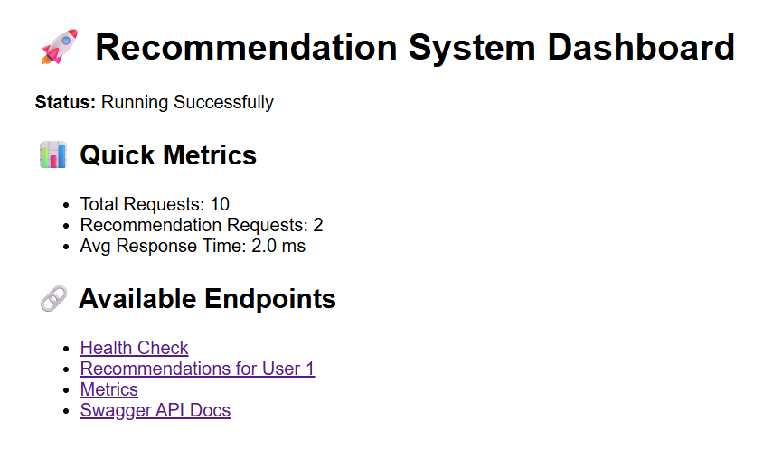
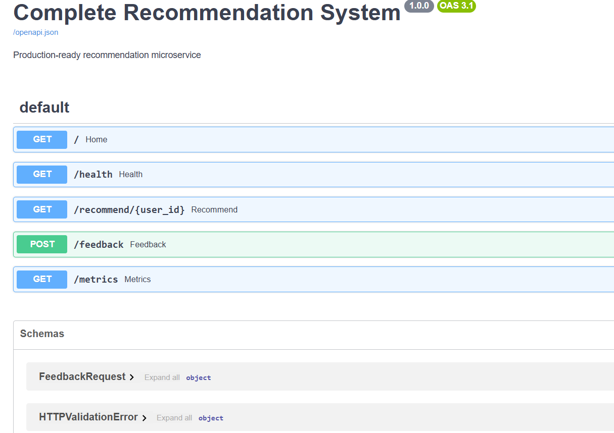
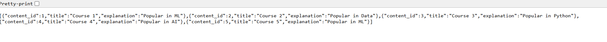

# 📊 Prototype Evaluation Report — Complete Recommendation System

This report documents the **prototype-level validation** of the recommendation system using the seeded sample dataset included in the project.

The goal of this evaluation is to verify:
- functional recommendation flow
- seeded ranking correctness
- cold-start fallback behavior
- API response validity
- metric computation logic on sample relevance sets

This report does **not claim real-world production benchmarking or live-user performance validation**.

---

# 📂 Dataset Summary
The evaluation uses the seeded SQLite dataset.

- Seeded Users: 10
- Seeded Courses: 20
- Categories: AI, ML, Data, Python
- Feedback Recording: Enabled
- Cold Start Handling: Enabled
- Database: `recommendation.db`

---

# 🎯 Ranking Metric Validation
The evaluation computes prototype ranking metrics using actual evaluator functions.

## Metrics Computed
- Precision@5: 0.60
- Recall@5: 1.00
- NDCG@5: 0.89

These metrics are derived from:
- seeded recommendation output: [1, 2, 3, 4, 5]
- seeded relevant items: [1, 3, 5]

This validates **ranking metric correctness on deterministic sample data**.

---

# 🧪 Functional Validation Results
- recommendation endpoint returns ranked course results
- feedback endpoint stores interaction records
- health endpoint confirms service status
- cold-start users receive popularity fallback recommendations
- invalid users return proper error responses
- evaluator functions execute successfully
- seeded database contains expected rows

---

# 📸 Screenshots
## Dashboard

## Swagger API Docs

## Recommendation Output

---

# ✅ Conclusion
The recommendation system prototype successfully demonstrates API routing, SQLite integration, modular recommendation orchestration, cold-start fallback, feedback persistence, and seeded sample-data metric validation.
